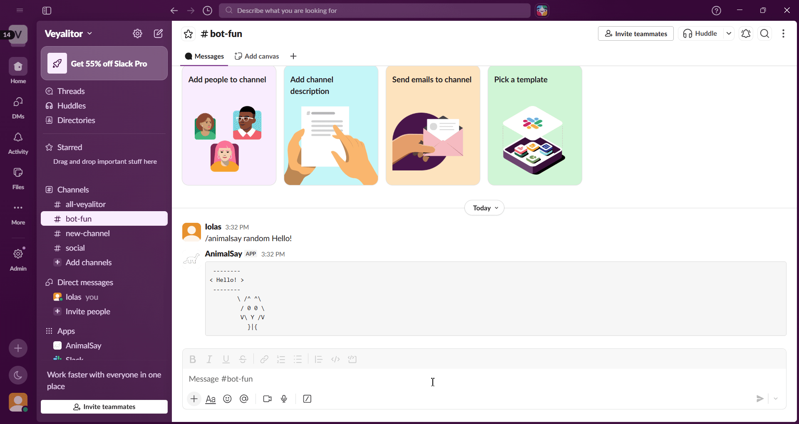
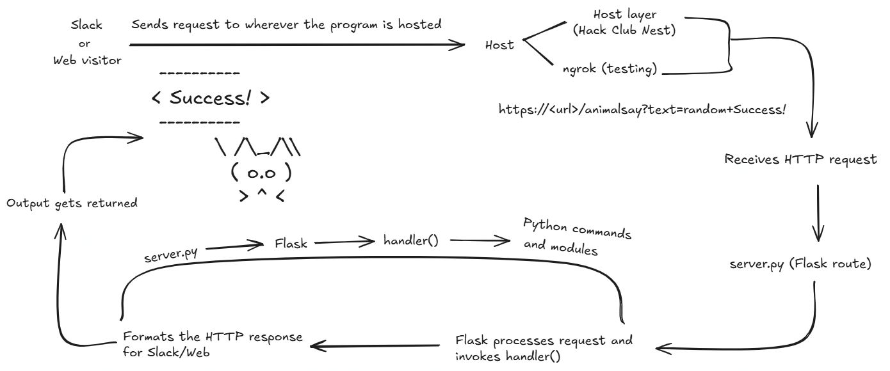

# **AnimalSay**
A cowsay-inspired Slack bot which can generate ASCII art of multiple animals saying user-inputted text. Currently, it can be accessed through either Slack or a web interface.



## **Architecture**



The bot is currently hosted on a VM provided by Hack Club Nest. Slack sends a POST request to the configured endpoint, which is routed to the Flask application. Flask processes the request, extracts the relevant arguments, and passes them to `handler()`. The handler coordinates the various Python modules, generates the requested ASCII art, and returns the formatted output to Slack, where it is displayed to the user.


## **Current Features**
- Slack slash command integration
- Flask-powered web API
- Multi-line speech bubbles
- Random animal selection
- Modular Python architecture
- Self-hosted on Hack Club Nest

### **Commands**
- `list`
- `help`
- `stats` *(in progress)*
- `<animal>/random <message>`

### **Currently supported animals**
- cow
- dog
- cat
- owl
- dino

## **Running locally**
1. Clone the repository
```bash
git clone https://github.com/10la5-Veygarn/animalsay.git
cd animalsay
```
2. Install dependencies
```bash
pip install -r requirements.txt
```
3. Start the server
```bash
python server.py
```
or
```bash
gunicorn server:py
```
4. Visit http://127.0.0.1:5000/